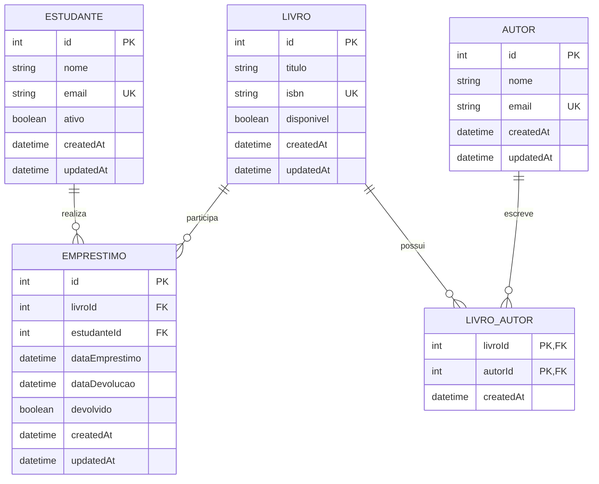

# Trabalho 2 — API Biblioteca com Prisma ORM

Projeto preparado para Node.js 24, Prisma ORM 7, SQLite e Prisma Client gerado em TypeScript, executado com `tsx`.


# Trabalho 2 - Persistência de Dados com Framework ORM

UFRB - Universidade Federal do Recôncavo da Bahia - Polo Feira de Santana - BA  
Curso: Licenciatura em Computação — 4ª Semestre  
Disciplina: Desenvolvimento de Software II  
Docente: Tassio Valle  
Discente: Leandro Oliveira Lima

## 1. Sobre o projeto

Este projeto é a evolução da API REST desenvolvida no Trabalho 1. O armazenamento que antes era feito em arrays em memória foi substituído por persistência em banco relacional utilizando **SQLite** e **Prisma ORM**.

A aplicação mantém o domínio de biblioteca do Trabalho 1 e acrescenta autores, relacionamentos, migrations, seed, paginação no banco, filtros, ordenação, tratamento de integridade e operações transacionais.

## 2. Tecnologias

- Node.js
- Express
- Prisma ORM 7
- SQLite
- JavaScript (ES Modules)

## 3. Justificativa do SQLite

O enunciado permite SQLite mediante justificativa. Foi escolhido por ser um SGBD relacional leve, baseado em arquivo e adequado ao porte e ao contexto acadêmico da aplicação. A escolha evita a necessidade de manter um servidor de banco separado e facilita a reprodução do ambiente pelos integrantes da equipe e pelo avaliador.

A utilização do SQLite não substitui os requisitos de persistência: o projeto utiliza Prisma ORM, migrations versionadas, chaves estrangeiras, restrições de integridade, índices, consultas com filtros/paginação e transações.

## 4. Modelo de dados

O modelo foi construído a partir do domínio de biblioteca já utilizado no Trabalho 1.



### Relacionamentos

- Um estudante pode possuir vários empréstimos (1:N).
- Um livro pode participar de vários empréstimos ao longo do tempo (1:N).
- Um livro pode possuir vários autores e um autor pode participar de vários livros (N:N), usando `LivroAutor` como tabela de junção.

## 5. Integridade e restrições

Foram utilizadas:

- chaves primárias;
- chaves estrangeiras;
- `NOT NULL` nos campos obrigatórios;
- `UNIQUE` para e-mails e ISBN;
- valores padrão para `ativo`, `disponivel` e `devolvido`;
- `createdAt` e `updatedAt` nas tabelas principais;
- índices para campos usados em consultas frequentes;
- `ON DELETE RESTRICT` nos relacionamentos que não devem permitir exclusão de registros ainda relacionados.

Uma tentativa de excluir um registro que possui relacionamentos é convertida pela API em resposta HTTP `409`.

## 6. Migrations

O histórico possui duas migrations em momentos distintos:

1. `20260919180000_create_core_tables`
   - cria estudantes, livros e empréstimos;
   - define chaves, restrições e índices.

2. `20260919181000_add_authors_and_relations`
   - adiciona autores;
   - adiciona a tabela de junção `LivroAutor`;
   - cria o relacionamento N:N entre livros e autores.

As migrations são mantidas como histórico e não devem ser editadas depois de aplicadas. Alterações futuras devem ser feitas em novas migrations.

## 7. Seed

O arquivo `prisma/seed.ts` cria dados de demonstração:

- 10 estudantes;
- 12 livros;
- 10 autores;
- 10 empréstimos.

Os empréstimos são distribuídos entre devolvidos e ativos para permitir a demonstração das regras de disponibilidade, filtros e relacionamentos.

## 8. Instalação do zero

### Requisitos

- Node.js 20.19+ (o projeto foi preparado para a linha Node 24 utilizada no desenvolvimento);
- npm.

### Instalar dependências

```bash
npm install
```

### Configurar ambiente

Copie:

```text
.env.example
```

para:

```text
.env
```

O conteúdo esperado é:

```env
DATABASE_URL="file:./dev.db"
PORT=3001
```

O arquivo `.env` não deve ser versionado.

### Gerar o Prisma Client

```bash
npx prisma generate
```

### Criar/aplicar as migrations

Em ambiente de desenvolvimento:

```bash
npx prisma migrate dev
```

### Popular o banco

```bash
npx prisma db seed
```

No Prisma ORM 7, o seed é executado explicitamente com `prisma db seed`.

### Iniciar a API

```bash
npm start
```

A API ficará disponível em:

```text
http://localhost:3001
```

## 9. Endpoints

### Livros

- `GET /livros`
- `GET /livros/:id`
- `POST /livros`
- `PUT /livros/:id`
- `DELETE /livros/:id`

Filtros:

```text
GET /livros?titulo=dom
GET /livros?autor=machado
```

Paginação e ordenação:

```text
GET /livros?pagina=1&limite=5&ordenar=titulo&direcao=asc
```

### Estudantes

- `GET /estudantes`
- `GET /estudantes/:id`
- `POST /estudantes`
- `PUT /estudantes/:id`
- `DELETE /estudantes/:id`

Exemplo:

```text
GET /estudantes?nome=ana&pagina=1&limite=5&ordenar=nome&direcao=asc
```

`GET /estudantes/:id` também retorna os empréstimos relacionados do estudante.

### Autores

- `GET /autores`
- `GET /autores/:id`
- `POST /autores`
- `PUT /autores/:id`
- `DELETE /autores/:id`

### Empréstimos

- `GET /emprestimos`
- `GET /emprestimos/:id`
- `POST /emprestimos`
- `PUT /emprestimos/:id`
- `DELETE /emprestimos/:id`
- `PUT /emprestimos/:id/devolver`

Filtros:

```text
GET /emprestimos?devolvido=false
GET /emprestimos?estudanteId=1
GET /emprestimos?livroId=1
```

## 10. Paginação e filtros

A paginação é executada pelo Prisma no banco, usando `skip` e `take`, e não por `filter()` ou `slice()` sobre uma lista carregada para a memória.

As consultas também utilizam `where` para os filtros e `orderBy` para a ordenação.

Isso evita a abordagem do Trabalho 1 em que os dados eram mantidos em arrays e filtrados pela aplicação.

## 11. Operação transacional

A criação de um empréstimo envolve duas alterações relacionadas:

1. criar o registro de empréstimo;
2. marcar o livro como indisponível.

Essas operações são executadas dentro de uma transação Prisma. Se uma etapa falhar, a transação é revertida.

A devolução também utiliza transação:

1. marca o empréstimo como devolvido;
2. registra a data de devolução;
3. torna o livro novamente disponível.

## 12. Tratamento de erros

A API não devolve mensagens brutas do SGBD.

Exemplos:

- `400` — dados obrigatórios ausentes;
- `404` — registro ou rota inexistente;
- `409` — violação de integridade, duplicidade ou operação incompatível com o estado atual;
- `500` — erro interno não previsto.

Violações de `UNIQUE` são convertidas para `409`.

Violações de chave estrangeira também são convertidas para `409`.

## 13. Organização em camadas

O acesso ao banco foi isolado em `repositories/`.

```text
src/
├── controllers/
├── repositories/
├── routes/
├── middlewares/
├── utils/
├── docs/
├── lib/
└── app.js
```

Os controllers recebem as requisições e coordenam a operação, enquanto os repositories concentram o acesso ao Prisma.

## 14. OpenAPI

A documentação resumida da API está disponível em:

```text
GET /openapi.json
```

Também existe:

```text
GET /docs
```

para uma visualização simples das rotas principais.

## 15. Teste rápido

Depois de executar migrations e seed:

```bash
npm start
```

Teste:

```text
GET http://localhost:3001/
GET http://localhost:3001/livros?pagina=1&limite=5
GET http://localhost:3001/estudantes/1
GET http://localhost:3001/autores
GET http://localhost:3001/emprestimos?devolvido=false
```

Para criar um empréstimo:

```json
{
  "livroId": 1,
  "estudanteId": 1
}
```

Se o livro estiver disponível, a API cria o empréstimo e altera a disponibilidade do livro dentro da mesma transação.

## 16. Evolução em relação ao Trabalho 1

No Trabalho 1, os dados eram mantidos em arrays em memória. Nesta versão, os mesmos recursos principais foram persistidos em banco relacional por meio do Prisma ORM.

Além da persistência, o projeto passou a possuir:

- modelagem relacional;
- migrations;
- seed;
- relacionamentos 1:N e N:N;
- integridade referencial;
- paginação no banco;
- filtros no banco;
- ordenação configurável;
- transações;
- tratamento centralizado de erros;
- separação em camadas;
- documentação OpenAPI.

## 17. Observação sobre Git

O Trabalho 2 deve ser entregue como evolução do repositório do Trabalho 1. Por isso, os arquivos desta etapa devem ser adicionados ao mesmo repositório, preservando o histórico anterior.

Não devem ser versionados:

```text
.env
node_modules/
prisma/dev.db
```

O arquivo `.env.example` deve permanecer versionado para permitir a reprodução do ambiente.

